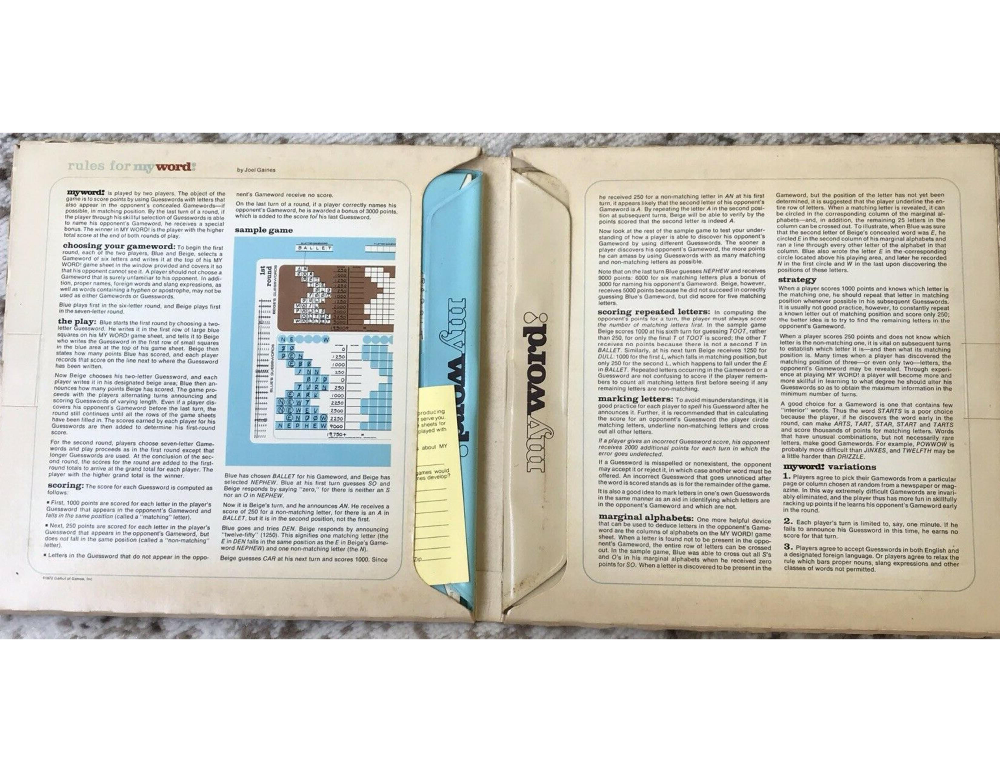
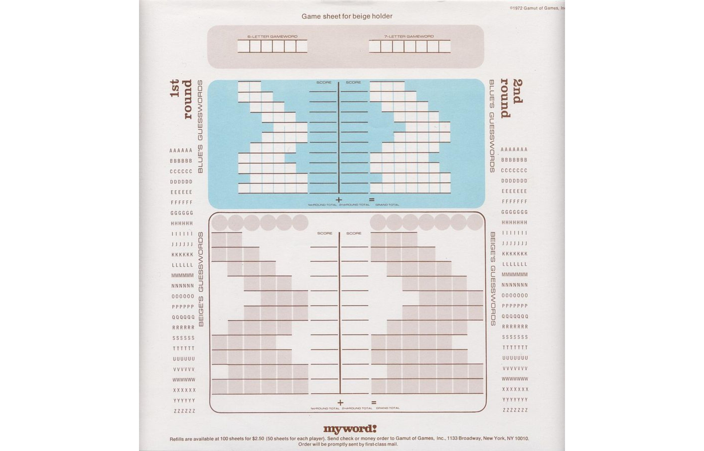
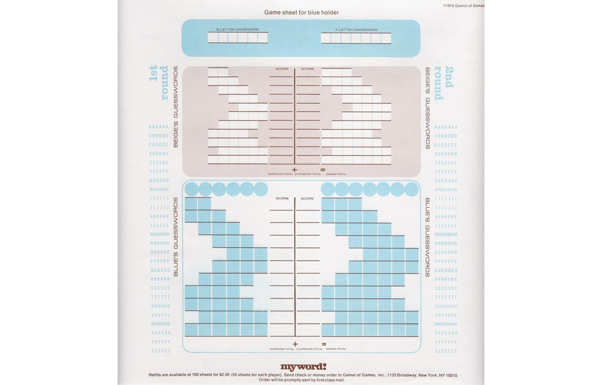
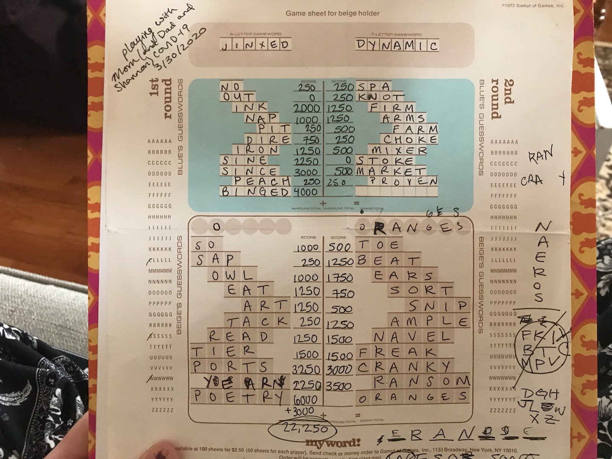
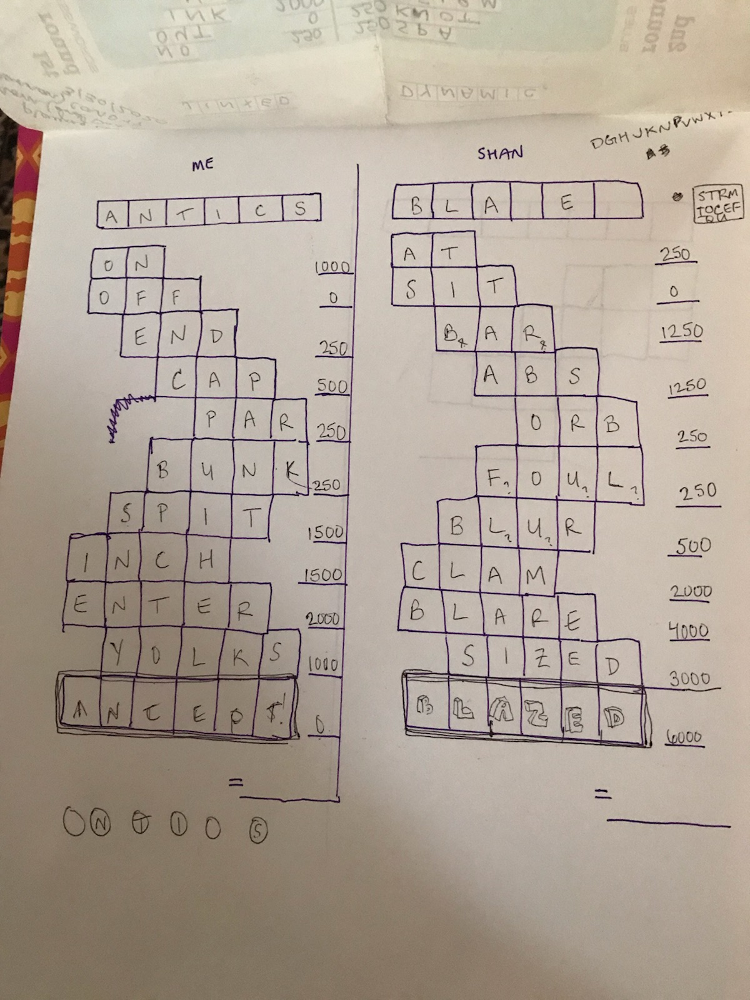

# MyWord!

## Play it!

imagine a link here

## Run it locally

1) `npm start`
2) go to http://localhost:3000/

## Description

MyWord is my new favorite word game. It can be played in person, over the phone, and now online too!

<3 :D :P <3 :D <3 :P :D <3

## Rules

### Game Setup

* One player creates room, sends code to second player
* Another player uses code to join room
* Each player chooses a word of length N
  * In MVP, N = 6 but plan for N of 7 as well

### Course of Play / Roadmap

* 11 turns/guesses per player
* each turn:
  * when all guesses are in, server scores both
    * if (n = N) checkForBonus(guess_word, goal_word)
  * then, emits current board state (with private goal words excluded)
* after 11 turns, emit winner, final scores, and goal words

Int N: length of goal word (in characters)

Int n: length of current turn's guesses (in characters)

Int p: 0-based offset for guess' position (in characters)

| turn |  n  | n if N=6 | p |
|:----:|:---:|:--------:|:-:|
|  00  | N-4 |    2     | 0 |
|  01  | N-3 |    3     | 0 |
|  02  | N-3 |    3     | 1 |
|  03  | N-3 |    3     | 2 |
|  04  | N-3 |    3     | 3 |
|  05  | N-2 |    4     | 2 |
|  06  | N-2 |    4     | 1 |
|  07  | N-2 |    4     | 0 |
|  08  | N-1 |    5     | 0 |
|  09  | N-1 |    5     | 1 |
|  10  | N   |    6     | 0 |

### Scoring

* scoring should happen purely; dependent only on current turn (idempotent lambda)
* score function called on guess event

|            letter            |  score |
| ---------------------------- | -----: |
| wrong letter, wrong position |     0  |
| right letter, wrong position |   250  |
| right letter, right position |  1000  |
| bonus for guessing the word  |  3000  |

## Example Sheets

## Tech Stack

React
GraphQL
AWS Amplify

## Contributors

- [Nancy Alter](https://github.com/ngalter)

- [Lorenzo Evans](https://github.com/LorenzoEvans)

- [Brittany Morris](https://github.com/brittanymorrisdesign)

- [Jacob Scarf Merrell](https://github.com/jacobscarfmerrell)
